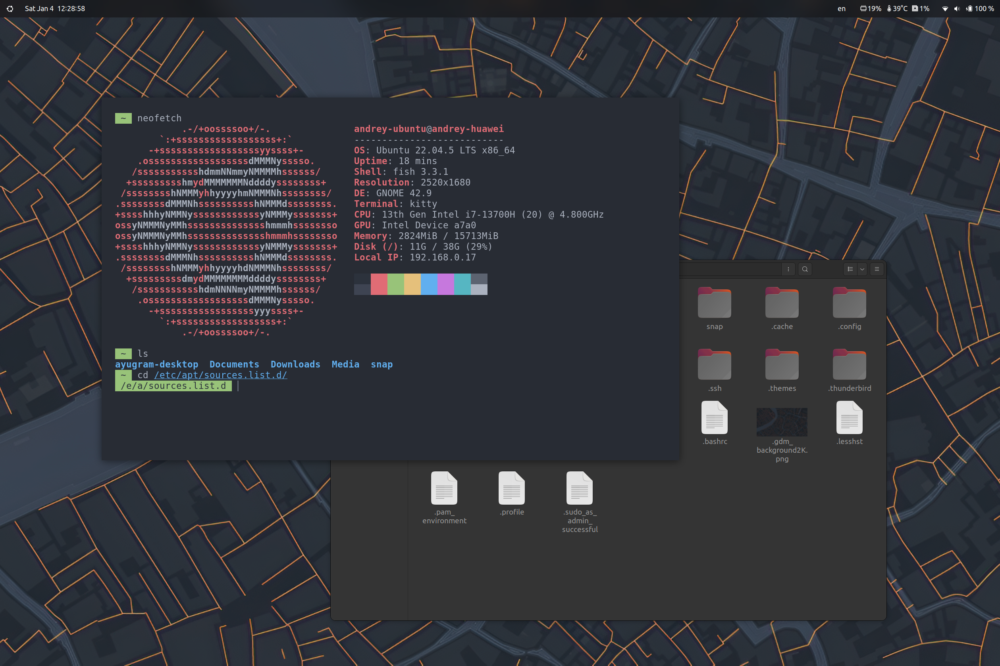
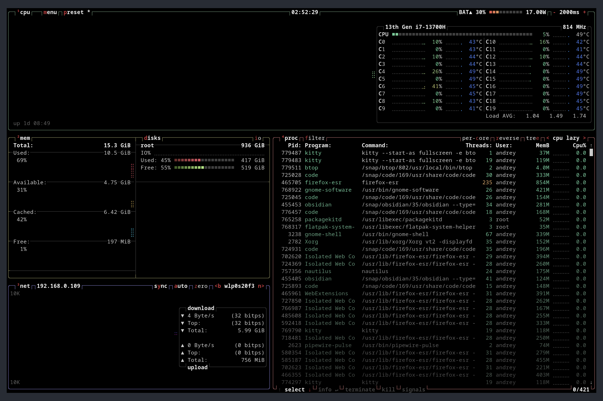
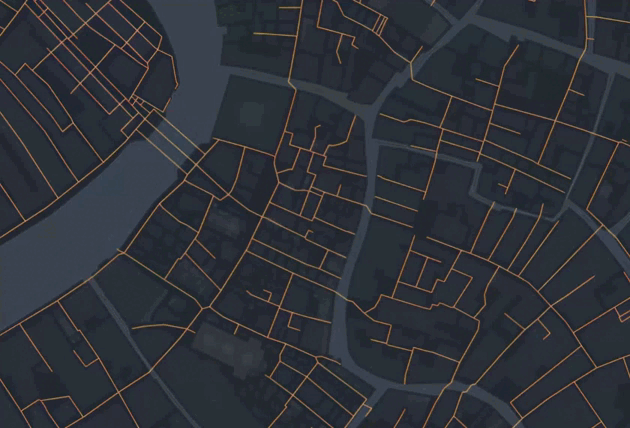
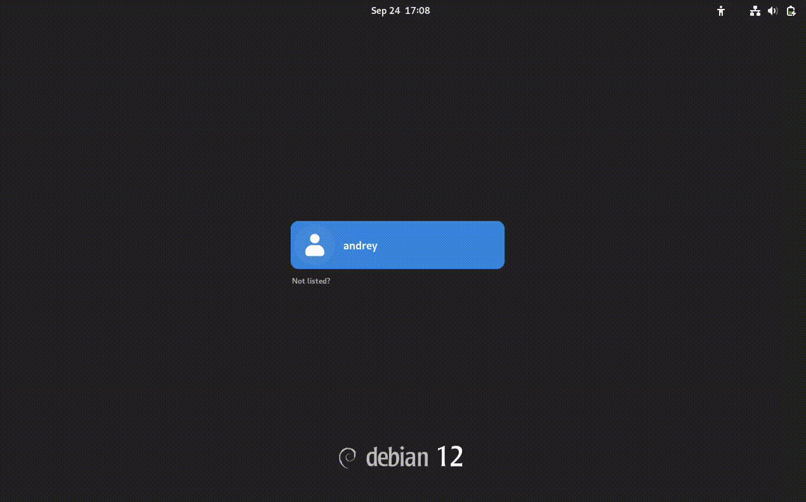

# Dotfiles
## Introduction
This repository was created to quickly install my settings, configs and applications on Ubuntu Gnome. This dotfile parodies the capabilities of bspwm (switching desktops, disabling minimize buttons, closing windows, etc.), but leaves the original settings and applications native to gnome. Unlike my other [configuration for Debian](https://github.com/KroJIak/debian-gnome-dotfiles), I use the Ubuntu system as a backup system and for testing applications, which does not require the installation of many additional applications.
# About
- **Distro:** Ubuntu 22.04.5 LTS (Jammy Jellyfish)
- **Display Server:** X11
- **Display Manager:** GDM
- **Desktop Environment:** Gnome 42.9


- **Terminal:** Kitty
- **CLI Shell:** Fish
- **File Manager:** Nautilus


- **Sound Mixer:** PulseAudio
- **Task Manager:** btop++


- **GTK Theme:** Orchis orange dark


- **Web Browser:** Firefox
- **Quick Access Toolbar (Dock replacement):** Gnome Pie


# Setup
`Total installation time:` **`__ minutes`**
## Ubuntu Expert Installer
First, you need to install the Ubuntu 22.04 image. The installation can be done via a USB flash drive.
Next, select the following options:
`Install Ubuntu`
#### Updates and other software
- What apps would you like to install to start with?
  - [x] Normal installation
- Other options
  - [x] Download updates while installing Ubuntu
  - [x] Install third-party software for graphics and Wi-Fi hardware and additional media formats
#### Installation type
- you can handle it yourself :)
#### Who are you?
- Your-computer's name: change it to what you want (for example, `"andrey-huawei"`)
- Pick a username: preferably in small letters (it will be more convenient, for example, `"andrey-ubuntu"`)
- Choose a password for the new user: Just a password
#### Installation Complete
- Choose `Restart now`

## Automatic installation
In order not to manually install all the components, a script ([install.sh](install.sh)) was built to install each of the stages automatically. Also, don't forget to look at the #Extra Steps tab

If you do not want to install something from below, the installation of each component is scheduled in stages.
## Manual installation
### Removing applications
I left some applications from gnome, because they are more convenient than their counterparts and have functionality related to gnome itself, but I deleted some of them:
#### Update packages
```Terminal
sudo apt update -y && sudo apt upgrade -y
```
#### Remove this packages **([remove_trash.sh](scripts/apps/remove_trash.sh))**
```Terminal
sudo apt remove -y aisleriot gnome-calendar gnome-logs gnome-characters gnome-mahjongg gnome-mines gnome-sudoku gnome-system-monitor rhythmbox seahorse shotwell totem gnome-todo remmina
```
### Installing applications
#### Snap installing **([snap.sh](scripts/apps/snap.sh))**
Before you start installing applications, you need to install snap, for easy installation of other applications.
```Terminal
sudo apt update -y && sudo apt upgrade -y
sudo apt install snapd -y
```
#### Required applications **([required_apps.sh](scripts/apps/required_apps.sh))**
The following applications are required to install for easy use. I decided not to stray far from the decision of the author of the [repository](https://github.com/addy-dclxvi/debian-bspwm-dotfiles) and also use the `kitty` terminal with `fish`.
```Terminal
sudo add-apt-repository ppa:danielrichter2007/grub-customizer -y
sudo apt update -y
sudo snap install btop
sudo apt install -y dconf-editor gnome-tweaks chrome-gnome-shell gnome-shell-extensions fish gnome-pie grub-customizer kitty pulseaudio curl git neofetch

# Change the default shell to fish
sudo chsh $USER -s /usr/bin/fish
```
If your laptop is Huawei 14s/16s, you may have some sound problems. To solve this, run the fix [script](scripts/fixes/huawei_sound_fix/install.sh) (taken from [here](https://github.com/Smoren/huawei-ubuntu-sound-fix)).

I also recommend using `flameshot` instead of the standard screenshot app:
```Terminal
sudo apt remove gnome-screenshot && sudo apt install -y flameshot
```
#### Optional applications **([optional_apps.sh](scripts/apps/optional_apps.sh))**
For my tasks, I use the following minimal application stack. This installation is optional.
```Terminal
sudo apt update -y && sudo apt upgrade -y
sudo apt install -y qbittorrent
sudo snap install code --classic
sudo snap install obsidian --classic
# sudo snap install telegram-desktop # | Optionally install ayugram-desktop from telegram channel
```
#### Removing unnecessary packages
```Terminal
sudo apt autoremove -y
```
### Installing configs and extensions
In addition to the applications themselves, you need to install wallpapers, configs of these applications, settings and extensions with their configs.
#### Adding images **([add_images.sh](scripts/custom/add_images.sh))**
```Terminal
cp ../../home/background2K.png ~/.background2K.png
cp ../../home/gdm_background2K.png ~/.gdm_background2K.png
```
#### Adding configs **([config.sh](scripts/custom/config.sh))**
```Terminal
sudo rm -r ~/.config
cp -r ../../config ~/.config 
```
#### Adding extensions **([set_extensions.sh](scripts/custom/set_extensions.sh))**
```Terminal
mkdir ~/.local/share/gnome-shell/extensions
cp -r ../../extensions/backup/* ~/.local/share/gnome-shell/extensions/
dconf load /org/gnome/shell/extensions/ < ../../extensions/settings_backup.txt
```
To enable them, run the following commands after restarting **([enable_extensions.sh](scripts/custom/enable_extensions.sh))**:
```
gnome-extensions enable just-perfection-desktop@just-perfection
gnome-extensions enable mediacontrols@cliffniff.github.com
gnome-extensions enable logomenu@aryan_k
gnome-extensions enable tiling-assistant@leleat-on-github
gnome-extensions enable Vitals@CoreCoding.com
gnome-extensions enable quick-settings-avatar@d-go
gnome-extensions enable top-bar-organizer@julian.gse.jsts.xyz
gnome-extensions enable Bluetooth-Battery-Meter@maniacx.github.com
gnome-extensions enable blur-my-shell@aunetx
gnome-extensions enable trayIconsReloaded@selfmade.pl
gnome-extensions enable block-caribou-36@lxylxy123456.ercli.dev
gnome-extensions enable user-theme@gnome-shell-extensions.gcampax.github.com

gnome-extensions disable desktop-icons@csoriano
gnome-extensions disable appindicatorsupport@ubuntu.com
gnome-extensions disable ubuntu-dock@ubuntu.com
```
#### Updating ssh config **([update_ssh_config.sh](scripts/custom/update_ssh.config.sh))**:
```
mkdir $HOME/.ssh
SSH_CONFIG_FILE="$HOME/.ssh/config"

if [ ! -f "$SSH_CONFIG_FILE" ]; then
    touch "$SSH_CONFIG_FILE"
fi

echo -e "\n# HostKeyAlgorithms for all hosts" >> "$SSH_CONFIG_FILE"
echo -e "\nHost *\n    HostKeyAlgorithms +ssh-rsa" >> "$SSH_CONFIG_FILE"
```
### Setting themes
To make the system look beautiful, I use [theme for the appearance](https://github.com/vinceliuice/Orchis-theme) of the desktop and a [theme for loading grub](https://github.com/adi1090x/plymouth-themes), disabling all logs and dialog boxes.
#### Orchis theme (desktop)
```Terminal
git clone https://github.com/vinceliuice/Orchis-theme
cd Orchis-theme
bash install.sh --theme orange --color dark --size standard
gsettings set org.gnome.desktop.interface gtk-theme 'Orchis-Orange-Dark'
gsettings set org.gnome.shell.extensions.user-theme name 'Orchis-Orange-Dark'
cd ..
sudo rm -r Orchis-theme

sudo apt install -y libglib2.0-dev dconf-cli
git clone --depth=1 https://github.com/realmazharhussain/gdm-tools
cd gdm-tools
sudo bash install.sh
set-gdm-theme backup update
set-gdm-theme set -b ~/.gdm_background2K.png
cd ..
sudo rm -r gdm-tools
```
#### Plymouth theme (grub)
```Terminal
sudo rm /etc/default/grub
sudo cp grub /etc/default/
sudo update-grub

# make sure you have the packages for plymouth
sudo apt install -y plymouth

# after downloading or cloning themes, copy the selected theme in plymouth theme dir
sudo rm -r /usr/share/plymouth/themes/hexagon-dots-alt
sudo cp -r ../../../grub-theme /usr/share/plymouth/themes/hexagon_dots_alt
# install the new theme (angular, in this case)
sudo update-alternatives --install /usr/share/plymouth/themes/default.plymouth default.plymouth /usr/share/plymouth/themes/hexagon_dots_alt/hexagon_dots_alt.plymouth 100

# select the theme to apply
sudo update-alternatives --config default.plymouth
# update initramfs 
sudo update-initramfs -u
```
## Extra Steps
- Be careful with the automatic installation. The scripts are not perfect and maybe some will not work for you, as they may only fit my system or account. I advise you to figure out each step of the installation yourself
- After any of the installations, do not forget to change the graphics platform from wayland to Xorg, otherwise at least the gnome pie menu will not work: 
- I noticed that some applications cannot save the result if the window is closed not through the X (cross) button, but simply by closing (for example, when old keys are rebinded. To return the window close button, enter the command: `gsettings set org.gnome.desktop.wm.preferences button-layout :close`
# Keybinds
Keybinds were made based on the names of applications or associations with them. To launch the rest of the applications, `gnome pie` or search is used (clicking on win and entering the name).
- **`Super + Enter`** Launch terminal
- **`Alt + A`** Launch Gnome Pie
- **`Super + Q`** Close window
- **`Super + W`** Launch Firefox
- **`Super + E`** Launch Nautilus
- **`Super + T`** Launch Ayugram
- **`Super + O`** Launch Obsidian
- **`Super + P`** Change the monitor mode
- **`Super + A`** Minimize the window
- **`Super + S`** Launch Settings
- **`Super + K`** Log Out
- **`Super + L`** Lockscreen
- **`Super + ;`** Power off
- **`Super + C`** Launch Calculator
- **`Super + B`** Launch btop++
- **`Super + Tab`** Change the window in the current workspace
- **`Super + {number}`** Switch to the `{number}` workspace
- **`Super + Shift + {number}`** Move the window to the `{number}` workspace
- **`Alt + Tab`** Change the window on all workspaces
- **`PrtSc`** Take screenshot using flameshot
- **`Shift + PrtSc`** Open flameshot settings
- **`Super + LMB`** Move window
- **`Super + MMB`** Resize window
## Credits
Some material was taken from other repositories and has been slightly modified:
- [Debian bspwm dotfiles](https://github.com/addy-dclxvi/debian-bspwm-dotfiles) | **Author:** [addy-dclxvi](https://github.com/addy-dclxvi) | **Taken:** background image, `kitty` config, `fish` config, some keybinds
- [Orchis theme](https://github.com/vinceliuice/Orchis-theme) | **Author:** [vinceliuice](https://github.com/vinceliuice) | **Taken:** green dark theme
- [Huawei ubuntu sound fix](https://github.com/Smoren/huawei-ubuntu-sound-fix) | **Author:** [Smoren](https://github.com/Smoren) | **Info:** for huawei 14s / 16s users (also work with Debian)
- [plymouth themes](https://github.com/adi1090x/plymouth-themes) | **Author:** [adi1090x](https://github.com/adi1090x) | **Taken:** used `cubes` theme from pack 1
Also take a look at the original Debian system customization repository in a similar way:
- [Debian gnome dotfiles](https://github.com/KroJIak/debian-gnome-dotfiles) | **Author:** [KroJIak](https://github.com/KroJIak)